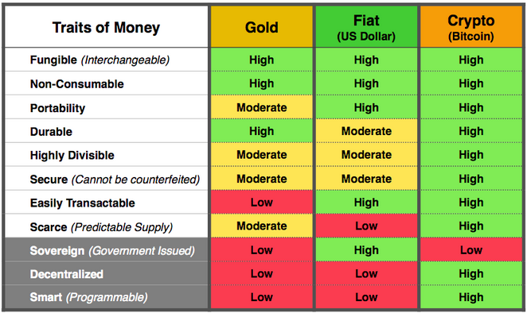

# Intro to Blockchain ⛓
By [Alexis](https://github.com/alexis-l8) and [Anita](http://github.com/neats29/)

---
🧗‍♀️
# Anita

- Background
- FAC4 (January 2015)
- Started learning about Blockchain May/June 2017

---
🕵️‍♂️
# Alexis
- Background
- FAC10 (February 2017)
- Started learning about Blockchain in 2013

---
🕵️‍♂️
# Centralisation, Decentralisation, Distributed Networks

---

🧗‍♀️
# Centralised systems
- Facebook
- Google
- Natwest
- Bank of England
- Your FAC project app (probably)

---
🧗‍♀️
## Advantages:
- Speed
- Simple governance

## Disadvantages:
- Single point of failure
- Susceptible to corruption and government surveillance

---
🧗‍♀️
# Decentralised systems
- Bitcoin
- Ant colonies
- Market economy
- The Tor network

---
🧗‍♀️
## Advantages:
- Less susceptible to corruption
- More fault tolerant (if one entity goes down, others can carry on)
- Attack resistant (no single point of failure)

## Disadvantages:
- Harder to govern (have to ensure incentives are aligned)
- Duplication of work
- Speed of action (harder to coordinate)
---

🕵️‍♂️
# History of Money 🤑
- Money is the first and main application of blockchain so far
- Double coincidence of wants
- What is money

---
🧗‍♀️
# History of Money 💵
Commodity -> Representative Money -> Fiat -> Crypto

---
🕵️‍♂️
# History of Money 💸
- Central Banks
- Quantitative Easing
- Inflation

---
🕵️‍♂️
# Blockchain Analogy

---
🕵️‍♂️
# Bitcoin 🔗 & bitcoin 💰
- Jan 2009 Satoshi Nakamoto
- First blockchain protocol
- Digital currency

---
🧗‍♀️
# Bitcoin Deep Dive 🏊‍♀️
- Hashing (sha256 -> 64 characters)
- [PoW](https://anders.com/blockchain/blockchain.html)

---

# Questions

---

